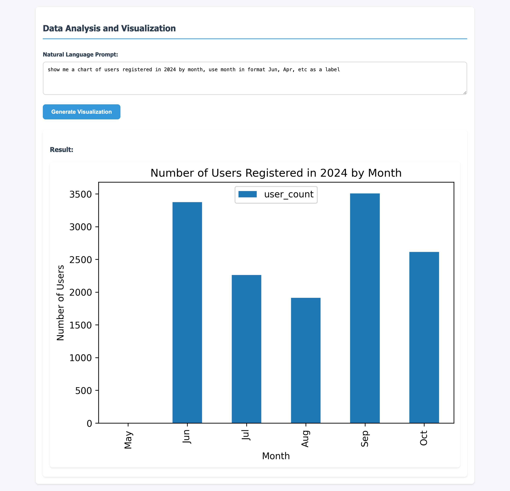

# Data Analysis and Visualization Tool

A lightweight data visualization tool that allows engineers and analysts to quickly retrieve data from PostgreSQL databases and generate visualizations using simple text prompts.



## Project Overview

This tool was generated based on specific technical requirements to create a minimal, efficient data analysis and visualization interface. It combines a Flask backend with a Vue.js frontend to provide a straightforward way to query databases and visualize results.

### Key Features

- **Simple Text-Based Interface**: Enter SQL queries and visualization commands through a clean web interface
- **Direct PostgreSQL Integration**: Connect directly to PostgreSQL databases
- **Multiple Visualization Types**: Support for various chart types including:
  - Line charts
  - Bar charts
  - Scatter plots
  - Histograms
  - Pie charts
- **Real-Time Visualization**: Instantly generate and display visualizations based on query results
- **Error Handling**: Clear error messages for invalid queries or visualization requests

## Use Cases

This tool is designed for:

1. **Data Analysts**:
   - Quick data exploration without writing visualization code
   - Rapid prototyping of different visualization approaches
   - Ad-hoc analysis of database contents

2. **Engineers**:
   - Debugging data-related issues
   - Monitoring data patterns
   - Generating quick visualizations for reports

3. **Database Administrators**:
   - Visualizing query results
   - Analyzing data distributions
   - Checking data relationships

## Project Structure

```
project/
├── app.py                 # Flask backend application
├── requirements.txt       # Python dependencies
├── .env.example          # Example environment variables
├── .gitignore            # Git ignore rules
├── templates/
│   └── index.html        # Main HTML template
└── static/
    └── app.js            # Vue.js frontend application
```

## Setup Instructions

### Prerequisites

- Python 3.x
- PostgreSQL database
- pip (Python package manager)

### Installation

1. **Clone the repository**:
   ```bash
   git clone <repository-url>
   cd <project-directory>
   ```

2. **Create and activate a virtual environment** (recommended):
   ```bash
   python -m venv .venv
   source .venv/bin/activate  # On Windows: .venv\Scripts\activate
   ```

3. **Install dependencies**:
   ```bash
   pip install -r requirements.txt
   ```

4. **Set up environment variables**:
   ```bash
   cp .env.example .env
   ```
   Edit `.env` with your actual credentials and configuration:
   ```
   # Database Configuration
   DB_HOST=your_actual_host
   DB_PORT=5432
   DB_NAME=your_actual_database
   DB_USER=your_actual_username
   DB_PASSWORD=your_actual_password

   # Server Configuration
   SERVER_HOST=0.0.0.0
   SERVER_PORT=5000

   # OpenAI API Key
   OPENAI_API_KEY=your_openai_api_key
   ```

   - Default server configuration will run on all interfaces (0.0.0.0) on port 5000
   - You can obtain an OpenAI API key from [OpenAI's website](https://beta.openai.com/signup/)

### Running the Application

1. **Start the Flask server**:
   ```bash
   python app.py
   ```

2. **Access the application**:
   Open your web browser and navigate to:
   ```
   http://localhost:5000
   ```

## Usage Guide

### 1. Writing Natural Language Prompts

Enter your request in natural language in the prompt field. Describe the data you want to retrieve and how you want it visualized.

**Example Prompts**:

- "Show me a bar chart of total sales per region for the last quarter."
- "Plot a line graph of daily active users over the past month."
- "Visualize the distribution of order amounts with a histogram."

### 2. Generating Visualizations

1. Enter your natural language prompt.
2. Click "Generate Visualization".
3. View the result below the form.

## Security Considerations

**Warning**: Executing code generated from natural language prompts can pose significant security risks. This tool is intended for use in secure, controlled environments. Do not expose this functionality to untrusted users or over the internet without proper security measures.

- The application attempts to mitigate risks by restricting available functions during code execution.
- Despite precautions, there is still potential for malicious code execution.

## Limitations

- Only supports PostgreSQL databases
- Limited to static visualizations
- Basic styling and formatting options
- No data export features
- No interactive visualization features

## Development Notes

This project was generated based on specific requirements focusing on:
- Minimal file structure
- Simple user interface
- Core functionality without unnecessary complexity
- Easy setup and deployment

## Contributing

While this is primarily a demonstration project, contributions are welcome:

1. Fork the repository
2. Create a feature branch
3. Commit your changes
4. Push to the branch
5. Create a Pull Request

## License

This project is open-source and available under the MIT License.

## Acknowledgments

This project was generated based on specific technical requirements outlined in the task documentation, with a focus on simplicity and functionality for data analysis needs. 